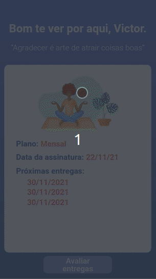

# Gratibox 🙏🏼

</br>

<p align="center">
  
   
   
</p>

</br>

## About ❔

Aiming to encourage a healthier lifestyle, this website (design for mobile) delivers a box with healthy and #gratitude products. Customers will be able to choose between two recurring subscription plans, weekly or monthly. Each box contains assorted products such as teas, organic products, incense. Customers cannot choose the products and do not know what will be shipped in each box. 😇

<!-- ## Preview

um gif da aplicação bem maneiro -->

</br>

## Deployment 🚀

<p align="center"><a  href="https://gratibox-two.vercel.app/">https://gratibox-two.vercel.app/</a></p>

</br>

## Features ✅

- [x] register and login into the website
- [x] subscribe to a plan
- [x] choose between weekly or monthly plan
- [x] access plan details and upcoming delivery dates
- [_] evaluate deliveries

</br>

## How to run 🏃‍♀️💨

```bash
# Clone this repository
$ git clone <https://github.com/victordurco/gratibox>

# Access the project folder cmd/terminal
$ cd gratibox

# Install the dependencies
$ npm install

# Compile the code
$ npm run build

# Run the application
$ npm start

# The server will automatically start at localhost:3000/ on your favorite browser
```

</br>

## Tech Stack 💾

<br/>

<p align="center">


</p>

</br>

<!--
### Contributors and Contact

### Acknowledgements -->
